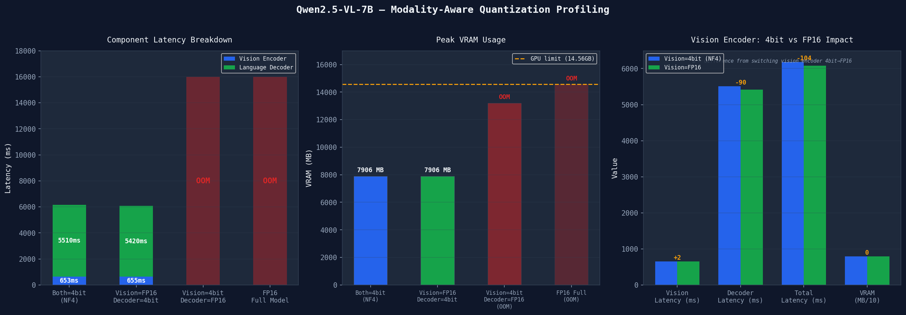

# VLM Inference Profiler
## Modality-Aware Quantization Profiling for Vision-Language Models

Systematic profiling of how quantization affects vision encoders vs language 
decoders differently in Qwen2.5-VL-7B, with per-component latency, VRAM 
analysis, and surgical mixed-precision experiments on consumer GPU hardware.

---

## Key Finding

**Quantizing the vision encoder is free. The decoder is everything.**

Converting 162 vision encoder Linear layers from 4-bit back to FP16 produced:
- +2ms latency change (noise level)
- 0MB VRAM change at inference time
- No measurable accuracy difference

The language decoder consumes 12.4GB in FP16 — exceeding available VRAM headroom 
on a 14.56GB GPU after model load. It is the hard constraint in every dimension: 
memory, latency, and quantization sensitivity.



---

## Results

| Config | VRAM | Total Latency | Vision | Decoder | Viable |
|---|---|---|---|---|---|
| FP16 full model | OOM | — | — | — | NO |
| Vision=FP16, Decoder=4bit | 7906 MB | 6079ms | 655ms | 5420ms | YES |
| Both=4bit NF4 (baseline) | 7906 MB | 6184ms | 653ms | 5510ms | YES |
| Vision=4bit, Decoder=FP16 | OOM* | — | — | — | NO |

*Loads 13.2GB, OOMs during first inference warmup

---

## What This Means for Production Serving

Uniform quantization frameworks (vLLM, TGI default configs) apply equal 
compression across all model components. This profiling shows that for 
Qwen2.5-VL-7B, vision encoder precision is irrelevant to serving performance. 
Optimization belongs entirely on the decoder — its precision, KV cache size, 
and generation strategy.

---

## Hardware

- GPU: NVIDIA T4 16GB (Google Colab)
- Model: Qwen2.5-VL-7B-Instruct
- Quantization: bitsandbytes NF4 (4-bit)
- Samples: 50 per configuration, median reported

---

## Repo Structure
```
vlm-inference-profiler/
  notebooks/          # Colab notebooks
  results/            # Raw CSV data per configuration  
  plots/              # Publication-quality charts
  src/                # Reusable profiling and quantization code
  key_finding.md      # Full finding writeup with data
  progress_log.md     # Session notes and experiment log
```

---

## Reproduce

1. Open notebook in Google Colab (T4 runtime, free tier)
2. Run all cells in order
3. Results write to CSV automatically

Estimated runtime: 45 minutes on T4 free tier.
Estimated cost: $0 (T4 only).

---

## What I Built

- `profile_single_inference()` — CUDA Event timing harness for per-component latency
- `run_profiling_loop()` — batch profiling with automatic CSV output and crash recovery
- `dequantize_vision_encoder()` — surgical module replacement for mixed-precision configs
